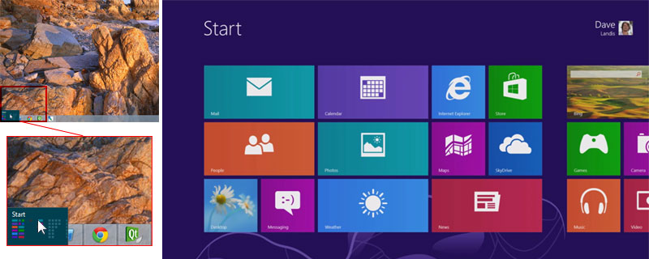

# Qt and the WinRT API

## Windows 8 - a "Modern" operating system
From the user perspective, Windows 8 might be perceived as a hybrid of two quite different user experiences. For traditional use cases, the Windows 8 desktop experience is largely the same as previous versions of Windows, apart from the new "Start Screen", which replaces the Start Menu. The Start Screen is based on a grid of "tiles", a concept introduced in the Windows Phone 7 "Metro" UI. For PC users, it serves as the glue between the desktop (i.e. mouse/keyboard interaction) experience and the more touch-oriented "Modern" experience. For Windows RT devices - that is, ARM-powered Windows tablets and touch notebooks - the desktop experience is available, but is reserved for Microsoft system applications only. Therefore, the emphasis is pushed even further toward the Modern UI environment and, consequently, the availability of these applications in the Windows Store. On Windows Phone 8, there is, of course, no desktop experience at all, with a touch experience that feels like a trimmed-down version of the Windows 8 Modern UI.

#### Left (detail): Windows 8 Desktop with Start Screen launcher in lower-left "hot corner". Right: sample Windows 8 Start Screen [MSDN](/appendix/references.md#windows-8-start-screen)

For application developers, the three user environments (Desktop, Modern, Phone) have various levels of access to the WinRT API. Generally speaking, Desktop development continues to use the existing [Win32](/appendix/terms.md#win32), although many of the WinRT APIs have been made available there as well. Modern UI apps may use the complete [WinRT](/appendix/terms.md#winrt) API as well as some existing Win32 APIs which have been "blessed" for use within the Windows Store (these exceptions are documented on [MSDN](/appendix/terms.md#msdn)). Windows Phone ([WinPhone](/appendix/terms.md#winphone)) applications have access to most of the WinRT API (interfaces only for desktop devices, such as cursor handling, being a major exception) as well as a few additional APIs which only make sense in the context of a phone. With this API split, covering all three environments in the same application would not seem practical. However, handling cases for both the Modern UI and Windows Phone in the same application should be straightforward (while some applications, such as [Google Chrome](/appendix/references.md#chrome-winrt), provide both Desktop and Modern UI in the same application). Given that desktop Windows is already a well-covered platform for Qt, the WinRT port of Qt is quite sensibly limited to the Modern UI environment (PCs, tablets, and phones), and not intended to be used from the Windows Desktop.

As detailed in the previous [section](xplatform.md), Qt is authored in C++ and therefore requires a C++ (or C-like) interface in which to hook into the platform details. Like Win32 before it, WinRT is a native API. It is, however, a rather "raw" API, in that it is based on the time-tested Component Object Model ([COM](/appendix/terms.md#com)) and designed for use with higher-level bindings. This is good for Qt, but application developers (who do not use Qt) will be encouraged to try one of several higher-level wrappers: .NET languages (including [C#](/appendix/terms.md#c-sharp) and [Visual Basic](/appendix/terms.md#visual-basic)), a new HTML/JavaScript framework, and a version of C++ with extensions called C++/CX. C++ and .NET developers may use the platform-styled [XAML](/appendix/terms.md#xaml) components, while web developers can opt for any HTML component set they see fit.

### Hooking In
One of the challenges with the C++ API is that its purest form (the COM classes within the "ABI" (for [Abstract Binary Interface](/appendix/terms.md#abi)) namespace) are not documented on MSDN. Rather the "C++" documentation is that of the C++/CX variant, which uses essentially the same classes but with more elegant, Java-style API. Developers utilizing the C++/CX will receive, among other things, automatic memory management of WinRT types through the use of (non-standard) smart pointers. This is accomplished through the use of compile-time metadata, but follows the syntax of the .NET language C++/CLI (hence being familiar to existing CLI programmers). While this may ease C++ development when compared to the traditional COM, it will have the challenge of reducing source compatibility with other compilers, syntax highlighers, and code editors. The Qt Project tends to avoid these types of vendor-lockin symptoms when possible, and it was therefore decided that these [CX extensions would not be used in Qt source](/appendix/references.md#c++-cx-blog). Should a project decide to do so, fresh C or C++ API headers can even been generated from the Interface Description Language ([IDL](/appendix/terms.md#idl)) files in the SDK, opening up possibilities for free toolchains such as MinGW.

This potential vendor lockin fuels the need for solutions like Qt. With the exception of the HTML toolkit, UI code reusability options will be minimal for developers seeking to port applications to (or from) the Windows Store. Even with the HTML toolkit, reusability in the UI may still remain challenging due to browser engine differences (most Cordova implementations use WebKit, not Internet Explorer), and particualarly challenging when custom native code solutions must be employed to extend the browser. A niche opens up for targeting developers who wish for good cross-platform portability of source code - in much the same way as web technologies - with the advantage of access to the native platform. Qt can offer developers a balance between the convenience and flexibility of HTML (a high-level canvas technology, Qt Quick) with the portability and low-level granularity of a native programming language. Developers can choose Qt on WinRT both for its value as a UI technology and to avoid vendor lock-in with code that only runs on Windows-based systems.

While issue of code portability can be smoothed out with Qt and the WinRT native API, Qt's controls will not look (or feel) like the platform's native control set - at least not initially. Qt is flexible enough to deal with this problem, however, and the styling API of Qt Quick Controls offers a path for the development of a native look-and-feel as well. While it will take significant development effort to align the WinRT platform styles within Qt Quick's control set, the ability to build free-style Qt Quick and Qt Widget applications should become available much sooner.

### Qt Platform Abstraction

In 2008, the Qt team released a product known as [Qtopia](/appendix/terms.md#qtopia), a Linux-based version of Qt without reliance on the commonly de-facto standard Unix windowing system, X11. The windowing system work for this port eventually became Qt for Embedded Linux after Nokia's acquisition of Qt in 2009. During that same year, Nokia worked on porting Qt to the [Symbian OS](/appendix/terms.md#symbian) as well, marking two new ports (eventually leading to two key platforms in Nokia's smartphone line) and considerable experience in how porting should be done. It was this knowledge that eventually led to a revamp in the entire porting strategy of Qt ports to come and the development of Qt Platform Abstraction ([QPA](/appendix/terms.md#qpa)), a system introduced in Qt 4.8 under the codename "Lighthouse". It was an important aspect in [Nokia's roadmap for Qt 5](/appendix/references.md#qt-lighthouse-has-grown-up), as it improved the ease of developing platform support for (particularly Linux-based) platforms. While a Qt 5 product was never shipped by Nokia, Qt 5 did inherit the strengths of QPA and was subsequently released by [Digia in December 2012](/appendix/references.md#introducing-qt-50).

QPA primarily deals with the platform's windowing system - it provides the "glue" between the expectations of Qt applications and the native APIs of the operating system's window manager (or lack thereof). It decides how to flush images to the screen, interfaces with the platform's user input system (i.e. keyboard, mouse, and touch), and provides hooks for native window styling/theming. It also provides an access layer for OpenGL, a key requirement for Qt Quick 2 applications.

A desktop window manager ([DWM](/appendix/terms.md#desktop-window-manager) is responsible for positioning, sizing, and compositing the windows of running applications with the desktop environment; key examples being Microsoft Windows, X11 (used on Linux/Unix variants), and Mac OSX. Embedded platforms - particularly embedded real time operating systems ([RTOS](/appendix/terms.md#rtos)) - may have a simplified window manager, or none at all. This was the primary use case for Qt for Embedded Linux - to provide a windowing system (Qt Windowing System - [QWS](/appendix/terms.md#qws)) where none was provided. QPA, which replaces QWS, does not require that the platform provides a concrete Desktop Window Manager ([DWM]) - only that it allows an abstract "window" to be created and drawn to. The platform implementer may can choose a number of options, from providing their own compositing window manager (e.g. by writing a [Wayland compositor](/appendix/terms.md#wayland)), to making window creation simple enough that "management" is not required (e.g. the [EGLFS](/appendix/terms.md#eglfs) technique). In the case of WinRT, basic window management is handled by the Modern UI environment; the WinRT Qt port needs to adapt to the features and constraints provided by this system.

Unlike a Desktop Window Manager ([DWM](/appendix/terms.md#dwm)), QPA is not responsible for composition of windows - it is only an access layer to an abstract windowing system, which may or may not provide composition. In general, it provides a path for Qt applications to draw to the device's screen (or even an [offscreen surface](/appendix/references.md#offscreen-rendering)!). This gives the platform implementer the freedom to provide only the needed entry points (e.g. framebuffer drawing and input handling) while leaving other portions (e.g. window decorations or platform theming) unimplemented if desired. Due to these minimalist requirements, the task of porting Qt to a new platform tends to be much easier as compared to its predecessor, the Qt Windowing System ([QWS](/appendix/terms.md#qws)) and the previous architecture of platform-specific private implementations ([PIMPLs](/appendix/terms.md#pimpl)). PIMPLs certainly still exist throughout Qt, but much of this type of code has moved to QPA.

In a practical sense, a platform implementer (e.g. developers porting Qt to WinRT) implements a QPlatform interface for each component of the port (Window, Screen, Cursor, Theme, etc.). These classes are made accessible via the QPlatformIntegration interface and neatly wrapped up inside a dynamically loaded _platform plugin_. This loose coupling not only allows for easier porting, it also allows the user of the application to switch between different plugin offerings. On some platforms, it even allows the application to be compiled once, but targetted for multiple windowing systems (e.g. X11 and Wayland) chosen at runtime. Eventually, it may be possible to support this use case for Windows 8 platforms as well (i.e. separate Desktop and Modern QPA plugins, but the same library binaries), but for now Qt must be built specifically for WinRT due to the the large amounts of Win32 code used in Qt outside of QPA.

[Previous: Cross-platform Programming](xplatform.md) | [Next: Requirements](requirements.md)
