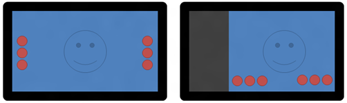
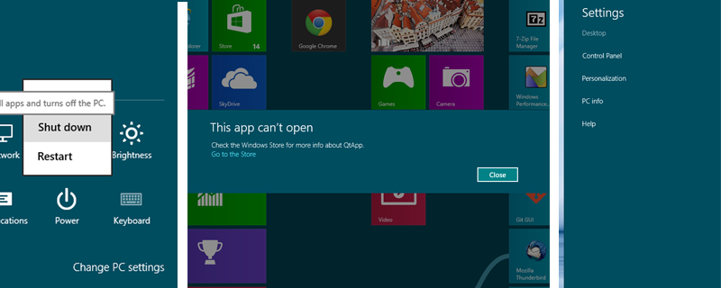

# Requirements for a complete port

From the experiences gained with Qt on Metro and a wide range of existing QPA plugins to use as examples, a porting strategy for WinRT becomes clear. Considering the platform details and Qt integration aspects discussed in the previous sections, there are five key points to address in completing the port:
- Identify unsupported Win32 APIs and replace them with WinRT APIs.
- Create a platform abstraction (QPA) plugin to run the Qt event loop and graphics system within the WinRT environment.
- Provide third-party solutions for missing middleware such as the OpenGL.
- Tweak Qt's UI technologies for use with WinRT (theming and native look-and-feel).
- Adjust the tooling to provide a standard Qt developer experience.

## Internal Details
Even though QPA handles most of the platform-specific code for a given port, it does not cover every integration point in Qt. This is because much of Qt's codebase lives within private implementations (PIMPLS) which do not fit into the QPA strategy. One of the reasons for this is that QPA is only used for GUI applications, and Qt supports non-GUI applications as well; hence, non-visual operations such as file I/O cannot be abstracted along with the rest of the port. Naturally, the "parent platform" for WinRT is Windows - much like Linux is the parent platform for Android and Mac OS is the parent platform for iOS. In other words, the parent platform already provides most of the platform-dependent codepaths; the child platform is essentially an adjustment to this. Using this as a base, the Windows PIMPLs provide a solid foundation for these implementations, but it is to be expected that some of this implementation must be rewritten for WinRT. As a result, the basic procedure of picking working through the core portions of Qt can be described as follows:
- Define a global platform macro (i.e. Q_OS_WINRT) for use in conditional compilation. Q_OS_WIN acts as the parent define, being defined as it is for all Windows platforms. Additional conditions for Windows Phone can be handled with Q_OS_WINPHONE.
- Find references to Win32 APIs that are not supported using WinRT. This can be done simply by attempting to compile Qt using the Windows 8 SDK. The SDK provides a macro, WINAPI_FAMILY, which defines which APIs are allowed for which particular Windows platforms. WinRT applications may set this to WINAPI_FAMILY_APP, which hides all unsupported APIs from the headers and results in compilation errors when they are used.
- When possible, find a reasonable equivalent for the Win32 API. When not possible, mark the Qt API as unimplemented.
- Test the functionality once everything can be compiled. Eventually, run and pass Qt unit tests on these new implementations.

Beyond the Qt library codebase, there is considerable build system code which also may require adjustments. To build qtbase, Qt is actually "bootstrapped" using a compiled program (configure.exe on Windows) or a Perl script (other platforms). This configure.exe program is inherited for WinRT as well, given that the compilation environment is similar to previous versions of Windows (and Windows CE). In addition, qmake is also likely to require adjustments in order to handle changes in the build system introduced by WinRT.

## Considering the Window Manager
The Windows 8 Modern UI does not use a DWM with traditional window geometry. Rather, it uses more of a tiled approach, whereby application windows cannot be layered or composed atop one another. Instead, applications can be displayed full-screen (one application at a time) or "snapped", that is, docked to the edge of the screen and a fixed width of 320 pixels (the term for the application taking the remaining space is called "filled"). Accordingly, all applications use the full height of the screen and are shown as single, top-level "canvas" with no window decorations. This window may be snapped or hidden, or returned to full-screen (and in the case of screens less than 1366 pixels wide, the window manager doesn't even allow snapping). In effect, the user can only see two running applications at a given time. This allows for basic cross-application use cases (such as drag-and drop), and it encourages applications to provide "[sidebar](/appendix/terms.md#sidebar)"-style use cases while in snapped mode.

<figure>
     
    <figcaption>Windows Store apps can be fullscreen, snapped, or filled. Compared to a traditional desktop, window management and resizing is much simpler; Qt applications tend to be most useful with a single, top-level window.</figcaption>
</figure>

These paradigm shift can be handled rather easily with QPA. In fact, fewer geometrical possibilities combined with no window chrome or complex compositioning should actually make the windowing system easier to handle than Desktop Windows.

## Addressing the issue of OpenGL
As mentioned earlier, OpenGL is a graphics API that is a widely implemented standard for making use of programmable graphics hardware. On Windows, OpenGL can be accessed through the Windows GL (WGL) library, whereby the backing implementation is provided by a hardware vendor (e.g. Nvidia or AMD, depending on the graphics chipset). With WinRT, WGL has become a ["legacy"](/appendix/msdn.md#opengl) graphics API and is not available for use within Windows Store applications. Instead, developers should use Direct3D 11, Microsoft's proprietary API for graphics acceleration. While this has the advantage that Microsoft is responsible for maintaining that Windows 8 devices ship with compatibile, compliant hardware, it breaks compatibility with code that relies on OpenGL. As Qt's primary UI toolkit, Qt Quick, is based on an OpenGL scene graph, this becomes a hard limit for making Qt Quick available on the platform.

Fortunately, this issue has already been at least partially addressed by the ANGLE ([Almost Native Graphics Layer](/appendix/terms.md#angle)) project. ANGLE is an [OpenGL ES 2](/appendix/terms.md#opengl-es-2) implementation built upon Direct3D 9 sponsored primarily by Google for use within its Chromium web browser. It was created with the purpose of bringing hardware-accelerated graphics (primarily for [WebGL](/appendix/terms.md#webgl)) to Windows PCs that lack a decent OpenGL implementation. In the past, this has been a common problem on Windows, with vendors providing quality drivers only for Direct3D. ANGLE, particularly its experiemental Direct3D 11 branches, promises a gateway to running Qt Quick successfully on Windows 8 devices.

## Other UI details
Once the aforementioned details are worked out (PIMPLs, platform plugin, and OpenGL), it should be possible to build user interfaces using Qt's existing graphics libraries, Qt Widgets and Qt Quick. From there, it needs to be evaluated what platform style changes are relevant for the new platform. Traditionally, Qt has offered style plugins for customizing the look-and-feel for a given platform (using the Qt Widgets platform). Styled widgets, however, have become less important with the introduction of the canvas-oriented Qt Quick UI framework. Until recently (Qt 5.1), styling Qt Quick components has been up to the developer. With the release of the Qt Quick Controls - a styled, supported Qt Quick component library - this is likely to change as includes a styling API for providing a platform look-and-feel to its components.

<figure>
     
    <figcaption>New integration points. Left: Popup (context) menu. Middle: Modal dialog. Right: Settings pane.</figcaption>
</figure>

Other UIs also exist beyond native look-and-feel of UI components. Context and system menus, for example, are typically defined by the operating system (and not necessarily painted by Qt). Windows 8 has introduces a few new UI concepts that need to be taken into consideration in this arena: popup menus, dialogs, and charms. Popup menus are typically used for contextual changes, and do not support nested menus like in previous versions of Windows. Dialogs are also quite similar to traditional desktop dialogs, but are styled differently and more strictly controlled by the platform (e.g. you cannot place custom widgets inside the dialog). Charms are yet another integration point that applications can use; they can be used for adding platform-consistent settings or search functionality to an application.

## Addressing tooling
Qt is more than a library - it is a collection of libraries and supporting tools. Because of this, simply porting Qt to a new platform is not enough to keep developers happy; the platform toolchain should be integrated with the common Qt Creator workflow. That is, developers should be able to write, launch, debug, and package their WinRT applications from the Qt IDE.

[Previous: Qt & the WinRT API](qt-and-winrt.md) | [Next: Core Issues](../method/core.md)
