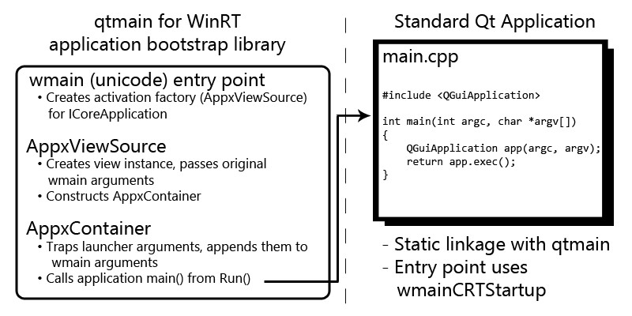

## Core issues

As discussed in the previous chapter, the first step to evaluating the state of C++ source code is to compile (and link) it. For large projecs, this also is likely to entail installing all dependencies and utilizing a build system to configure the build. Given the size of Qt, compiling it on a new platform is bound to reveal missing (or changed) APIs, unavailable libraries, compiler incompatibilities, or build system hiccups. In the case of WinRT, thankfully, the compiler itself hasn't changed much from previous versions of the Microsoft Visual Studio Compiler ([MSVC](/appendix/terms.md#msvc)), so makefiles generated by [qmake](/appendix/terms.md#qmake) can be used still be used with [nmake](/appendix/terms.md#nmake). For external dependencies, most of Qt's needs are covered in the "3rdparty" directory - many of which can be disabled or compiled in if necessary. From a build system perspective, WinRT keeps pace with Windows Desktop and Windows CE - inheriting most of its PIMPL details from these two existing ports. Also useful - as compared to Qt 4 - is Qt 5's improved modularity, making it simpler to compile parts of Qt independently of others. The remaining wrinkles can be ironed out through WinRT-specific codepaths.

## Make specifications
To cover the WinRT port, there are actually five different compilation targets to be considered - Windows 8 x86 32-bit, Windows 8 x86 64-bit, Windows RT ARM, Windows Phone ARM, and Windows Phone x86 (Emulator). Each of these environments comes with its own compiler variant and libraries - some even have a different set of system headers. To deal practically with all variations, a make specification - or "[mkspec](/appendix/terms.md#mkspec)" - [is defined for each compilation target](/appendix/gerrit.md#make-specification). The mkspec informs the Qt build system about the necessary paths and executables for not only building Qt applications, but also Qt itself. All WinRT mkspecs have been written with a common "parent" mkspec, which allows sharing of settings wherever possible.

### Build system changes
A number of [build system](/appendix/gerrit.md#build-system) changes were required in order to ensure proper support for Qt applications and to configure Qt itself. Many of these changes were contributed by community members, particularly Kamil Trcinski, during the project's "bootstrapping" phase. Changes to the configuration tool, configure.exe, allowed for certain parts of Qt to be left out of the compilation process, thus allowing few dependencies in exchange for potentially missing features - for example, the SQLite module was disabled due to missing memory mapping APIs. While native WinRT builds were relatively straightforward, support for the Windows Phone 8 system required additional changes to pull in the required headers, libraries, and cross compilers. This is a common issue for cross-compiled builds, as Qt requires both a native compiler for tools (e.g. qmake) as well as the cross-compiler for building the libraries and applications. Fortunately, the windows CE build support in configure.exe already tackles this issue, so [Window Phone support](/appendix/gerrit.md#windows-phone-build-system) was added in a similar fashion.

### File System Changes
With the build system in place, compilation issues could be tackled. One of the first code-level issues to address was the file system - particularly how file paths are handled. Within the WinRT sandbox, apps may only access files within the application package (read-only) or data folder (read/write). Therefore, it is best to access files using relative paths, with the root of the filesystem being the directory where the application is stored (as opposed to using absolute paths to the files). Apart from the app being aware of its location due to the path being passed at startup, there is little need for this information in general - all local resources must be obtained from within the app package (that is, the installation path). This is particularly important in Qt for plugin loading, as the modularized nature of Qt suggests that plugins tend to be dynamically loaded frequently. In order to get up and running, [several changes](/appendix/gerrit.md#file-handling) were required to make file handling act more "relative" in cases where Qt accessed files directly. Much of this work was done by Maurice Kalinowski, who also has spent significant time investigating the related tasks of packaging and deployment of [Qt as a WinRT framework](/appendix/references.md#wqt-winrt-framework).

### Environment variables
Apart from setting the environment with the debugger (discussed in the [Tooling](tooling.md) chapter), it is not possible for the application to access or set environment variables - or, more accurately, the sandboxed environment does not import global environment variables into the application's runtime environment. Therefore, it was decided that the WinRT port would simply write to/from a global in-memory map to emulate the functionality of environment variables. This is useful, as many parts of Qt change behavior based on variables within the environment; the developer is still able to change this behavior by ["setting" the variable in code](/appendix/gerrit.md#base-system). It does, however, limit the traditional use cases of an exposed environment; developers must find different ways to affect post-compilation behavior of their applications.

### Threading
WinRT introduces a number of new threading primitives for use within parallel programming. Threading is very important in Qt UIs, as Qt relies heavily on the concept of a main "GUI" thread and any number of "worker" threads for non-GUI tasks; the Qt Quick Scene Graph even adds a threaded rendering system for offloading rendering tasks into a non-GUI thread. Threading work was primarily a straightforward [shift to use of std::thread](/appendix/gerrit.md#base-system), a feature of the [C++11](/appendix/terms.md#c11) STL. In addition to replacing Win32 threads with std::thread, the Thread Local Storage (TLS) API was replaced with usage of the "thread" compiler attribute. The remaining Win32 unsupported APIs, such as WaitForMultipleObjects, could be replaced with their supported equivalents, such as WaitForMultipleObjectsEx. While threading is mostly functional at this point, [improvements are ongoing](/appendix/gerrit.md#threading), with related research into the Windows.Threading API namespace (as opposed to std::thread).

### Networking
While networking is outside the scope of this thesis, it is worthwhile to mention a few aspects of the [Qt Network](/appendix/terms.md#qt-network) port for WinRT, especially since some of the socket programming code lives within Qt Core. Networking presents one of the more interesting challenges in WinRT due to the rather large changes made in the Windows API for these tasks - primarily, the fact that the Windows Sockets (WinSock2) API is unavailable in WinRT. Curiously, Windows Phone supports the existing WinSock2 API, meaning that existing codepaths can work on phones (but not other devices). To this effect, [initial commits](/appendix/gerrit.md#networking) fixed up the WinSock2 codepaths for Windows Phone, while splitting up the functionality so that networking could be [temporarily disabled elsewhere](/appendix/gerrit.md#event-system). Given that a code split is not very practical in the long-run (and that networking needs to work on PC as well), it was decided that the entire network stack be ported to WinRT's new networking APIs, allowing the WinSock2 calls to be removed altogether. This work is ongoing, with major improvements coming in by Oliver Wolff.

## Bootstrapping Qt
With most of the non-GUI parts fixed up, it should be possible to acheive a runnable application. One of the more rewarding moments in application development is when the app itself is shown on the screen for the first time - in the case of running Qt on a new platform, at least. Due to the application container used in WinRT, a few adjustments to the application startup process needed to be made.

The first challenge was a COM threading issue, as [QCoreApplication](/appendix/terms.md#qcoreapplication) must run within the GUI thread, and WinRT does not run the GUI within the same thread as the C runtime ([CRT](/appendix/terms.md#crt)) entry point (i.e. main()). In order to support multiple application states (normal display, background task, suspended), the application is _activated_ by a launcher - typically the Start Screen, but other options, such as file associations, are also possible. In fact, the application executable cannot be run directly - it must be activated; in some cases it might already be running but suspended. The CRT "stub" is run and must create an application view [factory class](/appendix/terms.md#factory-class) which is passed back to the launcher for instatiation. This view factory calls the Run() method, which - for GUI purposes, at least - is the logical application entry point. As this occurs in a separate thread apartment from the CRT, it is imperative that Qt applications be instantiated here (as opposed to the CRT main). For a programmer using Qt, these details must be invisible in order to prevent requiring platform-specific code. Accordingly, this startup process must execute before the the application's main() function.

<figure>
     
    <figcaption>Design of the WinRT bootstrap to hide implementation detail from the programmer</figcaption>
</figure>

Fortunately, the process of "bootstrapping" a Qt application with a private main entry point is fairly common across Qt platforms. In Qt for Windows, this is accomplished by a static library called qtmain (found in qtbase/src/winmain), which does some initial setup before calling the main() entry point defined by the programmer. For WinRT, qtmain was modified to have [an alternative WinRT codepath](/appendix/gerrit.md#bootstrap) which instantiates the needed WinRT classes and then passes control to the user's main() function. A convenient workaround, the Unicode main CRT entry point (as opposed to the ANSI entry point), was used to avoid conflicts with the user's main(). Arguments from wmain are combined with any activation parameters (e.g. from the application that launched this one, such as the Start Screen or a file type association) and the application's main() is invoked with the combined argument list. Elegantly, this allows Qt for WinRT applications to require no additional configuration or manipulation of the source code in order to operate within the application container.

After successfully getting a test application launch and run within the Modern UI container, it was time to start tackling the user interface components of Qt.

[Previous: Requirements for a Successful Port](../background/requirements.md) | [Next: Platform Abstraction](qpa.md)
