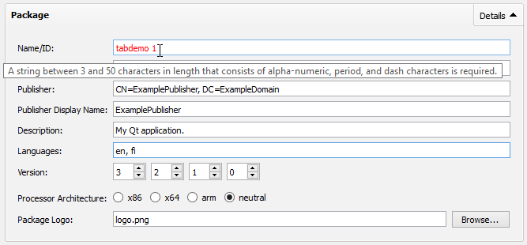
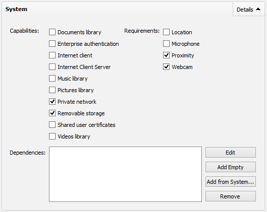
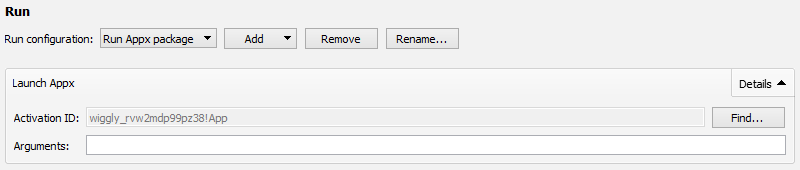

# Qt: Tuning up the Tools

Given the breadth of Qt's goals, it is no surprise that it comprises more than just libraries, but also a number of supporting tools. The most advanced of these is Qt Creator, the Qt integrated development environment ([IDE](/appendix/terms.md#ide)). Qt Creator is a desktop application designed to aid in the development and debugging of Qt applications (although it can also be used as an IDE for any general software project). It is able to manage a Qt project file (.pro file), invoke the corresponding tools (such as [qmake](/appendix/terms.md#qmake)), and launch interactive debugging sessions. It also has excellent code highlighting, navigation, and auto-completion facilities, standing out particularly well with support for Qt-based technologies like QML. It integrates well with other develompent tools, such as version control systems, and can be used for creating custom build routines. Qt Creator aims to offer a better overall development experience for Qt-based applications than found with other IDEs.

With any new platform, some adjustments to tooling follow. In order to support tooling for the new platform, a plugin for Qt Creator (the Qt IDE) was created to aid in launching and debugging WinRT applications[]. Naturally, if the IDE supports the developer's workflow as well or better than the native tools, there will be an increased uptake and usage of the toolchain. Accordingly, it was imperative that the most important tasks provided by the native IDE (Visual Studio 2012) be supported in Qt Creator: registering the app, launching the app, and attaching the debugger.

While Qt Creator supports several project types, qmake projects are the most common. In this project type, Creator parses the qmake project (.pro) file much like qmake would. It creates a project tree to allow the developer to visually traverse, organize, and edit their project. The developer can make build multiple build profiles - typically, one for each of their compilation targets - and set individual definitions or configuration options within each. Each build profile contains a settings pane for "Build" and "Run" to compile-time and run-time settings, respectively. For WinRT, the build system remains largely the same as Desktop Windows, so no changes were required in Qt Creator to handle this. Running applications, however, requires new procedures in WinRT, so this was where most of the Qt Creator plugin work was focused.

# Application Manifest Generation

As noted earlier, the packaging system is guided by an application manifest, an XML file containing various metadata about the app. This includes both visual information, such as icons and colors, as well as requested capabilities, such as network or webcam access. While similar, Windows Phone apps use a different packaging convention than other Windows Runtime targets. Given the many options available, and the ease of error when editing the XML by hand, a unified manifest editor was created for Qt Creator (keeping pace with the native IDE, Visual Studio). As with all XML files opened in Qt Creator, the user may alternatively use the standard text editor to modify the file. The Appx manifest is based on Microsoft's public schema and the open packaging conventions [] and is therefore well-defined and well-suited to be edited by both the user and external tools. The Windows Phone manifest uses a different schema and file name (WMAppManifest.xml), but is also user-editable and follows a similar (albeit simpler) structure to the Appx manifest.

As Qt project files are platform agnostic, platform-specific files like application manifests might typically be generated (e.g., by qmake) if all information is available in the project file. In cases where the files are complex or user-editable, however, this is beyond the scope of file generation. For this reason, it is the user's responsibility to create the manifest file, a paradigm already followed by the other mobile platforms suportted by Qt [][][]. There has been ongoing discussion about a "universal" manifest editor for Qt applications, but for now developers are expected to maintain a separate manifest for each platform. To this end, the user can create a new WinRT or Windows Phone 8 manifest file through the "Add New" action in either the File menu or the project's context menu; a wizard then appears which allows the file to be generated and the editor automatically opened. The manifest is also added to the project file. These file type associations (package.appxmanifest and WMAppManifest.xml) are mapped to a new manifest editor developed as part of the Qt Creator WinRT plugin [] which can read and write these XML files from a graphical tool.

The manifest editor consists of a series of collapsible "detail groups" modeled after Qt Creator's "Projects" pane. Grouping similar details and making the groups collapsible allows the user to manage the visibility of a moderate number of options without requiring additional search tools. It may also have an advantage over tabbed-based views (such as Visual Studio's editor) in that the user may have more than one detail group visibile within the same view. Furthermore, it allows for expansion of the editor (such as adding more detail groups) without the risk of running out of horizontal screen space (as would be the case of a tabbed view). It is also consistent with other parts of Qt Creator.

<figure>
     
    <figcaption>Qt Creator Package Manifest Editor, Packaging Details</figcaption>
</figure>

Perhaps the most important detail group in the manifest editor is the packaging tool. It provides the user with the most basic elements to modify: the project name, publisher information, and architecture information. Filling this detail group ensures that the minimally required elements are specified. Furthermore, validators are in place on all fields so that the user can be made aware of any potential errors within their input.

<figure>
     
    <figcaption>Qt Creator Package Manifest Editor, Tile Details</figcaption>
</figure>

Another helpful graphical aid in the manifest editor is the tile details group, which visualizes the tiles' look and feel on the Windows Start Screen. This tool aims to provide a benefit over the Visual Studio offering, which does not visualize the tile itself (and therefore requires the user to install the application to view the tiles in action). From Qt Creator, the user can modify the various visual properties of the tiles (background color, icon, label) and immediately see how the tile will appear on the Start Screen. The user can even interact with the icon to get a simulation of the "tilt" animations which occur when pressing a tile within the Modern UI.

<figure>
     
    <figcaption>Qt Creator Package Manifest Editor, System Details</figcaption>
</figure>

Another crucial view is the System details view, where the user can modify the permissions and hardware support required on the end-user device. Capabilities are essentially permissions for the application to access the user's media library, network, and other software resources. Requirements also act like permissions to hardware resources, but have the added constraint that the user's device must also support such features (for example, a phone must have NFC support for the "Proximity" requirement). Dependencies are software packages which must be installed with the application in order for it to work, such as software frameworks. The package management system enables download and installation of these frameworks automatically. This is especially important for Qt, as it will eventually allow the Qt Project (or even third-party developers, for that matter) to distribute official binary packages for applications to rely on, easing development and licensing concerns considerably.

While providing a graphical manifest editor is not a strict requirement for creating a usable Qt experience on WinRT, it should prove beneficial to helping developers tackle this platform-specific detail without significant new learning. The tooltips and error messages are designed to aid the developer in understanding what each component of the package manifest is modified and what it will affect in the application at installation and runtime.

# Application Registration and Launch
After the developer has an application and corresponding manifest, they may register the app and launch it. The Qt Creator plugin makes this possible all from within the IDE. In the Run settings pane, Qt Creator creates a default "run configuration" for launching the application locally; this typically contains a target executable and working directory. As Windows Store apps cannot be directly launched, these fields were removed and replaced with an "Activation ID" field[]. This activation ID is the same identifier used with the Appx PowerShell commands[] or the PLMDebug tool[]. As it is not likely that the user will know the ID, a "Find..." button is available for picking the application from a list. Inside the application picker, the user can filter out the name of their application. The "arguments" was left available, as the debugger allows for arguments to be passed to the application.

<figure>
     
    <figcaption>Qt Creator WinRT Application Launcher</figcaption>
</figure>

In order to launch the app, it must be registered with the Appx package system, so some extra elements were added to the form in order to ease this process. The first time the user arrives at this view, their application will neither be visible in the "Activation ID" field, or available in the "Select Appx Package" dialog[], which is available by clicking "Find..." next to the Activation ID field. If they try to launch their application without first choosing an application, the Select Appx Package dialog is automatically opened. At this point, the user should select a previously registered application, or register their application with the system by clicking "Add...". When adding an application, a file dialog appears and directs them to find their application manifest. This may be a point of confusion for developers, as it may not be immediately obvious that they need to create an application manifest manually. <<<To resolve this, the file dialog allows for creating a new file, and opens up the Appx manifest editor automatically.>>> If an error occurs, the error message is displayed in an alert dialog. The Windows-provided errors are normally sufficient for debugging, as they explain if e.g. a file is missing. In the special case that there is no developer license installed (or the license has expired), the dialog asks if the user would like to launch the developer registration tool[].

While a "normal" installation of an Appx package copies itself to a central directory, this "registration" is done in-place. That way, the developer can continue to modify the same files (e.g. images or QML) without re-installing the application. After successful registration (and in all cases where the application is detected as already registered), the Activation ID is filled with the ID obtained from the Appx selection dialog. This activation ID can be useful, as it can be used in the Appx management PowerShell commandlets[]. At this point, the user is ready to launch the application - they simply hit the "Run" or "Debug" buttons in Qt Creator (or use the associated shortcut keys). Internally, the IApplicationActivationManager[] API is used to launch the application. The user may reopen dialog again if they wish to choose a different application; they may also perform some application-specific settings - such as unregister or open appx manifest - through the appx context menu.

# Application Debugging
Once the application is launched, the process identifier (PID) of the app is passed back to the launcher. This PID can be used to monitor the application's lifetime and also forcefully terminate it. Most importantly, though, it can be passed to a debugger. As Qt Creator already supports the Windows command-line debugger (CDB), this is also used in debugging local WinRT applications. After launching the application, Qt Creator instructs CDB to attach to the running process. Qt Creator even includes built-in visualizers for debugging Qt types, giving it an edge over the native toolchain in that regard. Since WinRT applications run in fullscreen, it is wise to employ a multi-monitor setup in order to see both the application and the debugger at the same time.

<image of debugging - show both screens, point out that multiple monitors might be a good idea>

While local debugging was implemented rather easily[], remote debugging is an important task that is yet to be finished. Microsoft has unified their remote debugging solution for WinRT through an application called "msvsmon", the Visual Studio Remote Debugging Monitor. It is a service which runs on the client device (the debuggee) and allows a remote machine to launch interactive debugging sessions. Rather than the existing remote debugging protocol used by CDB and WinDebug (supported by Qt Creator), msvsmon uses Windows Web Services (WSSAPI)[] to communicate over-the-wire[]. This may not be a complete loss, as WSSAPI applications rely on a schema which can be implemented in a client-agnostic manner. Unfortunately, Microsoft has not made this schema public, making it difficult to interface with msvsmon unless this schema can be made available.

### Remote Debugging Insights
In order to understand the relationship between Visual Studio and the various debugging targets (x86 PC, x86 64-bit PC, ARM tablet, x86 Phone Emulator, and ARM Phone), a deeper investigation was required. Through the use of a network monitor (and guidance from the Windows Phone Power Tools project[]), it was observed that for the emulator and phone, CoreCon[] (a public .NET API) version 11 (version 10 is used with Windows Phone 7, and earlier versions with Windows CE) is used to facilitate communication with the remote device. The CoreConnectivity API was also tested locally[], and found to be integratable into Qt Creator via the Common Language Runtime ([CLR](/appendix/terms.md#clr)), but that would introduce some inherent "messiness" when dealing with mixed native and managed code. Also, not all assemblies have 64-bit versions, restricting potential Qt Creator builds to 32-bit only. Thankfully, the Visual Studio 2012 Update 2 release added a command-line tool, XapDeployCmd[], which covers the use cases of CoreCon without requiring using the API directly (and being a more natural fit for Qt Creator's mentality of controlling external applications).

<image of phone emulators>

A major limitation of XapDeployCmd (as well as CoreCon) is the lack of debugging features; it simply offers a way to install, remove, and launch applications. Given this limitation, it is understandable that Visual Studio might use separate tools to launch debug sessions. As it turns out, this is the case: observation of local network traffic showed that Visual Studio installs and launches msvsmon via CoreCon's RemoteAgent[] API (based on the known port number and observed plaintext transfer). The debugging monitor then listens on its normal port, 4016, for Visual Studio to attach to. From there, all communication is done through the msvsmon WSSAPI; debugging objects are passed to Visual Studio and interpreted. This paradigm of deploying and launching the debugger provides potential insight into how Qt Creator might be able to accomplish a similar setup; perhaps even to deploy a third-party debugging helper or remote debugging server.

For non-phone devices, CoreCon is not used in this debugging pipeline (it is a device service which only runs on embedded targets). Rather, msvsmon must be installed manually to the device; it is available as part of the Windows Remote Debugging Tools from Microsoft[]. Once installed, the service is either started manually or configured to run in the background. The debugging session then takes place over the network through Visual Studio, which authenticates with optional encryption[]. With encryption disabled, the traffic between the debugger and debuggee appeared similar in nature to that of the emulator - that is, XML transactions using the WSSAPI. To reiterate, the ability for Qt Creator to remotely debug these devices lies in the capability to interact with this WSS service, something which is currently not an open API.

< img of phone deployment >

While debugging is not yet possible, remote deployment for phone (and phone emulator) was added to the Qt Creator plugin by creating deployment steps for XapDeployCmd[]. This means that a developer will typically still need to launch Visual Studio if they want an interactive debugging session. For non-phone devices, one potential solution would be to support SSH/SFTP (as is done for Linux devices) or e.g. the Windows Remoting API[]. That way, CDB could be launched and the existing CDB debugging engine could attach to the session. This, however, doesn't cover ARM devices, which still lack a working solution. As this problem is yet to be solved for Desktop Windows, it may be that a unified approach (including, perhaps deployment from other operating systems) will be attempted in the future.

< img of simulator - requires more investigation >

In addition to the Windows Phone Emulators, there is also the Windows 8 Simulator. This simulator is essentially a remote desktop client which is logged into the host, providing a mechanism for simulating tablet features such as touch events and rotation. While launching the simulator is possible, the process of launching the application and attaching a debugger has not yet been investigated. It is quite likely that remote desktop scripting APIs could be used to instruct the application to launch with a debugging server attached, and Qt Creator could connect over the local network, much like is done for normal local applications.

# Application Packaging
Once the application is ready to publish - or, at least, ready to send to a colleague for testing - it should be packaged. As opposed to tradtional desktop applications, where the developer was responsible for creating an interactive installer, Microsoft provides the packaging and installation system. For non-phone, this is handled by Appx, based on the Open Packaging Conventions[]. Phone devices use the same packaging convention from Silverlight and WP7, XAP (although with some new schema elements added for WP8-specific features). In addition to Visual Studio, Microsoft provides both a command-line tool (makeappx.exe)[] and a C API [] for packaging apps. XAP packages, however, must be made manually if not done by Visual Studio. In both cases, the packages are simply ZIP archives with a certain file structure inside, so they are simple to implement without third-party tools.

Because Qt libraries must be packaged with the application (as well as other files marked for deployment), a need for a tool that can read the generated binary and copy the associated libraries needed to be developed. The result was windeployqt, a tool made by Friedemann Kleint. The vision of the tool is to ease the burden of copying DLLs not only for WinRT applications, but Windows applications in general. Contributions were made to the tool to support automated packaging of Appx and XAP packages[], improving the tool further. To round out the usefulness of the tool, automatic deploy steps were added to Qt Creator to make use of the tool easy for users of the IDE[].

<image of deploy steps>

## Signing
The application should be signed!

## Conclude

While not all use cases are yet covered, it is encouraging to see that Qt Creator can be used for most of the development workflow. Developers can create, register, launch, locally debug, and even package their applications using the IDE. From this foundation, it should be possible to evaluated the developer experience offered by the IDE and platform port when working with WinRT devices.
